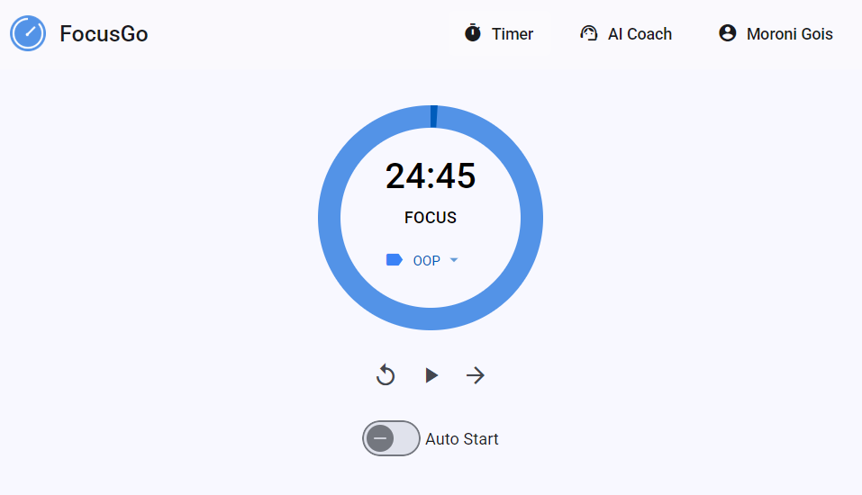

# FocusGo

A personal focus timer that uses AI to help you understand where your time actually goes.

🌐 **Live Demo:** [https://focusgo.app](https://focusgo.app)

## Overview

The Pomodoro Technique is a real, widely-used method for structuring focused work: work in fixed intervals, take a break, repeat. But a timer on its own doesn't tell you anything — it just counts down and resets.

FocusGo takes the Pomodoro technique and adds two things on top of it: **categorization** and **AI analysis**.

Every session is tagged with a category — Work, Study, Writing, whatever you define. The tag is the whole point: it's what turns "I did some pomodoros today" into "you're spending 70% of your focus time on Work, and your Study sessions have a 40% completion rate." Without the tag, there's nothing for the AI to reason about beyond raw minutes.

On top of that, an AI coach reads your session history — durations, completion, time of day, day of week, whether you took a break, which category — and talks with you about it: what patterns show up, when you're actually productive versus just pushing through, and what to try differently.



## How It Works

- Every session is logged with metadata built for analysis, not just a timestamp: category, planned vs. actual duration, day of week, hour of day, completed vs. abandoned, whether it followed a break, and its position in a streak of consecutive sessions.
- Categories (tags) are fully user-defined — add, rename, delete, drag-to-reorder. They're the primary dimension the AI groups and compares by.
- An AI Coach chat reads your last 30 days of session data, computes stats (completion rates, time-of-day patterns, category breakdowns), and answers questions like "how was my week?" or "when should I schedule deep work?" in plain conversation.
- Chat history persists per-user in Firestore, so the coach's conversations carry over across visits instead of starting from zero each time.
- Session data and categories sync to the cloud per-user (Firebase Auth + Firestore), so your history follows you across devices. The app also works offline and installs as a PWA.

**Example:**

```
You: How was my week?

Coach: Solid week! You completed 32 focus sessions totaling 13 hours:
  - Work: 18 sessions (56%) - 7.5 hours
  - Study: 10 sessions (31%) - 4.2 hours
  - Personal: 4 sessions (13%) - 1.3 hours

Your completion rate was 85% - above your usual 78%. Tuesday and
Thursday mornings were especially productive. You're doing best when
starting work by 9 AM — consider protecting that morning time.
```

## Tech Stack

- **Frontend:** Angular 18 + Angular Material (TypeScript)
- **Auth & Database:** Firebase Authentication (Google sign-in) + Firestore
- **AI:** GitHub Models API (GPT-4o-mini), an OpenAI-compatible chat completions endpoint
- **PWA:** Angular Service Worker (offline support, installable)

The app has no hosting-specific dependencies — see [Deployment](#deployment) below.

## Setup

### 1. Clone and install

```bash
git clone <this-repo>
cd pomodoro
npm install
```

### 2. Set up Firebase

You need your own Firebase project (Auth + Firestore) — this app doesn't ship with a shared backend. Follow [docs/FIREBASE-SETUP.md](./docs/FIREBASE-SETUP.md) for the step-by-step console setup, then copy your Firestore rules from `firestore.rules`.

### 3. Configure local secrets

```bash
cp src/environments/environment.example.ts src/environments/environment.local.ts
```

Edit `environment.local.ts`:
- Paste in your Firebase config (from the Firebase Console → Project Settings).
- Add a GitHub Personal Access Token for AI features: [github.com/settings/tokens](https://github.com/settings/tokens) → "Generate new token (classic)" → no special scopes needed for GitHub Models.

This file is gitignored and never committed. The app runs fine without the PAT — AI features are just disabled.

### 4. Run it

```bash
npm start
```

## Deployment

This is a plain Angular app — `npm run build` outputs static files to `dist/`, deployable to any static host. Nothing in the code is tied to a specific cloud provider; Firebase (auth/data) and GitHub Models (AI) are the only external services, and neither depends on where the frontend is hosted.

```bash
npm run build
```

Pick any static host — AWS Amplify, Netlify, Vercel, Firebase Hosting, Cloudflare Pages, GitHub Pages all work. The only two things any of them need to do:
1. Serve the contents of `dist/` (or your build output folder).
2. Provide your GitHub PAT as an environment variable at build time, injected into the production environment config the same way `environment.local.ts` does locally.

Whichever host you pick, also add its domain to Firebase Console → Authentication → Settings → Authorized domains, or Google sign-in will fail on that domain.

## Useful Links

- [Angular Documentation](https://angular.dev)
- [Angular Material](https://material.angular.io)
- [Firebase Documentation](https://firebase.google.com/docs)
- [GitHub Models](https://docs.github.com/en/github-models)

## Future Work

- **Tool calling instead of always preloading 30 days of data.** Right now every analytical message sends the full 30-day summary regardless of relevance; letting the AI request specific data (a category, a date range) on demand would cut token usage and enable more precise queries.
- **Semantic memory across conversations.** The coach currently only sees recent chat history plus session stats — it doesn't retain goals or experiments you've mentioned weeks ago. Extracting and storing compact semantic memory (profile, active experiments, key insights) would let it reference long-term context without resending entire chat threads.
- **Skip session-data injection for non-analytical messages.** Greetings and acknowledgments currently still trigger a full data fetch; detecting query intent first would reduce unnecessary cost and latency.
- **Real-world validation of AI insight quality.** The coaching patterns look reasonable qualitatively but haven't been validated against months of real usage across many users — whether the insights hold up at scale is untested.

Full design rationale and detailed comparison against a standard LLM-app architecture are in [docs/AI-ROADMAP.md](./docs/AI-ROADMAP.md) and [docs/AI-ARCHITECTURE-COMPARISON.md](./docs/AI-ARCHITECTURE-COMPARISON.md).

## AI Disclosure

AI was used as a coding assistant on this project, under my direction and review:
- Angular/Firebase integration code and UI styling.
- Architecture research and the comparison in AI-ARCHITECTURE-COMPARISON.md.
- AI Coach prompt design and chat integration logic.
</content>
